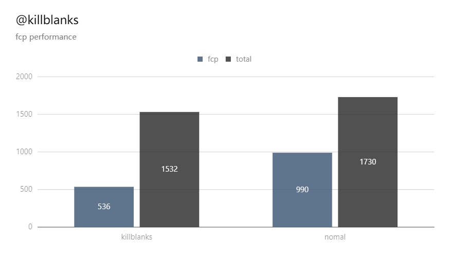

## Background

> White screens have always been a major problem that has plagued the front-end when the CSR project was born. How to increase the waiting time of users, reduce the bounce rate, and improve the page performance at low cost is the front-end has been solving problems, killblanks is one This kind of solution directly generates a skeleton screen from the page node, and pre-renders the user to display the outline of the content while waiting for the content to load, providing a better user experience and making the content feel faster.

## Principle

Use `Purpeteer` to simulate the browser request page function, load the page of `@killblanks/skeleton-ext` to generate the skeleton screen component, and directly output the `html` file

## Frame

<p align="center">
  
</p>

## Effect

<p align="center">
  
</p>

## Quick start

### 1. Install

```sh
  yarn add @killblanks/prerender -D
```

### 2. Config

```ts
// webpack.config.js
const prerender = require('@killblanks/prerender')

export default {
  ...
  plugins: [new prerender()]
  ...
}
```

- For more information, please check[@killblanks/prerender](./prerender/)

### 3. Use `@killblanks/skeleton-ext`

- For more information, please check[@killblanks/skeleton-ext](./skeleton-ext/)

### 4. Use the generated skeleton screen components in the project

- For example, like what is done in [DEMO](https://github.com/warpcgd/killblanks/blob/main/packages/docs%26demo/docs/.vuepress/components/effect/basic/index.vue)

```js
// index.vue
<template>
  <div class="container">
    <skeleton :show="!!filterProductList.length">
      <div class="productionList">
        <div v-for="(item, key) in filterProductList" :key="item.goods_id + key" class="production">
          xxx
        </div>
      </div>
    </skeleton>
  </div>
</template>

<script>
import skeleton from './skeleton'
export default {
  components: {
    skeleton
  },
  data: () => {
    return {
      filterProductList: []
    }
  },
  mounted() {
    setTimeout(() => {
      const res = JSON.parse(
        `{"goods_id":"5e7d6d331d41c801b95f594f","name":"skeleton-test","photo":"https://o-static.ihago.net/ikxd/e62403ac0d365c57b4dbc1a0ab7e9cf4/128.png","svga_photo":"","tag":"new","type":1,"type":1805,"real_price":199,"price":299,"discount":8000,"update_time":1594695268}`
      )
      this.filterProductList = Array(10).fill(res)
    }, 3000)
  }
}
</script>
```

```js
// skeleton.vue
  <script>
import Vue from 'vue'
const skeletonLoader = {
  name: 'skeletocnLoader',
  functional: true,
  props: {
    show: {
      type: Boolean,
      default: false
    }
  },
  render(h, context) {
    const { show } = context.props
    if (!show || window.__PRERENDER_INJECTED__) {
      const html = `<div>xxx</div>`
      const component = Vue.compile(html)
      return h(component)
    } else {
      return context.children[0]
    }
  }
}
export default skeletonLoader
</script>
```

### 5. Enter `PRERENDER_PREVIEW` in the Chrome console to start the skeleton screen preview

## Performance

### Data Sources:

Use the company's online activities in Indonesia to conduct abtest to obtain relevant data

### Data:

| type        | total | fcp | lcp |
| ----------- | :---: | --: | --: |
| @killblanks | 1532  | 536 | 661 |
| Normal      | 1730  | 990 | 993 |

### [First-contentful-paint(fcp)](https://github.com/w3c/paint-timing)

<p align="center">
  
</p>

- FCP average comparison: 536: 990 @killblanks can increase `454ms`, an average increase of `45%`

### [Largest-contentful-paint(lcp)](https://github.com/WICG/largest-contentful-paint)

<p align="center">
  
</p>

- LCP average comparison: 661: 993 @killblanks can increase `332ms`, an average increase of `33.4%`
