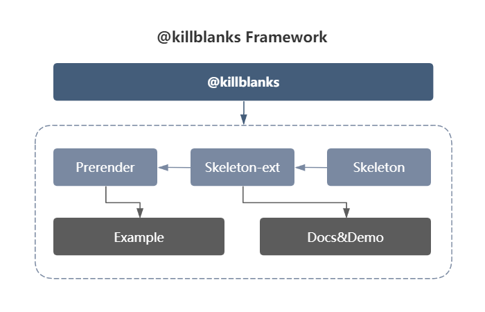

## 背景

> 白屏一直是 CSR 项目诞生来困扰前端的一大问题，如何在低成本的情况下，增加用户的等待时间，减少跳出率，以及提高页面性能，是前端一直在解决的难题，killblanks 作为其中一种的解决方案，将页面节点直接生成骨架屏，通过预渲染让用户能在等待内容加载时显示内容的轮廓，提供了更好的用户体验，并使内容感觉更快。

## 原理

利用`Purpeteer`能模拟浏览器请求页面的功能，加载`@killblanks/skeleton-ext`生成骨架屏组件的页面，直出 `html` 文件

## 框架

<p align="center">
  
</p>

## 效果

<p align="center">
  
</p>

## 快速开始

### 1. 安装

```sh
  yarn add @killblanks/prerender -D
```

### 2. 配置

```ts
// webpack.config.js
const prerender = require('@killblanks/prerender')

export default {
  ...
  plugins: [new prerender()]
  ...
}
```

- 更多配置请查看[@killblanks/prerender](./prerender/)

### 3. 使用@killblanks/skeleton-ext

- 更多配置请查看[@killblanks/skeleton-ext](./skeleton-ext/)

### 4. 将生成的骨架屏组件使用在项目中

- 比如像[DEMO](https://github.com/warpcgd/killblanks/blob/main/packages/docs%26demo/docs/.vuepress/components/effect/basic/index.vue)中所做的一样

```js
// index.vue
<template>
  <div class="container">
    <skeleton :show="!!filterProductList.length">
      <div class="productionList">
        <div v-for="(item, key) in filterProductList" :key="item.goods_id + key" class="production">
          xxx
        </div>
      </div>
    </skeleton>
  </div>
</template>

<script>
import skeleton from './skeleton'
export default {
  components: {
    skeleton
  },
  data: () => {
    return {
      filterProductList: []
    }
  },
  mounted() {
    setTimeout(() => {
      const res = JSON.parse(
        `{"goods_id":"5e7d6d331d41c801b95f594f","name":"skeleton-test","photo":"https://o-static.ihago.net/ikxd/e62403ac0d365c57b4dbc1a0ab7e9cf4/128.png","svga_photo":"","tag":"new","type":1,"type":1805,"real_price":199,"price":299,"discount":8000,"update_time":1594695268}`
      )
      this.filterProductList = Array(10).fill(res)
    }, 3000)
  }
}
</script>
```

```js
// skeleton.vue
  <script>
import Vue from 'vue'
const skeletonLoader = {
  name: 'skeletocnLoader',
  functional: true,
  props: {
    show: {
      type: Boolean,
      default: false
    }
  },
  render(h, context) {
    const { show } = context.props
    if (!show || window.__PRERENDER_INJECTED__) {
      const html = `<div>xxx</div>`
      const component = Vue.compile(html)
      return h(component)
    } else {
      return context.children[0]
    }
  }
}
export default skeletonLoader
</script>
```

### 5. 在浏览器的`console`启用`PRERENDER_PREVIEW`

```sh
  在Chrome console中输入`PRERENDER_PREVIEW`启动骨架屏预览
```

## 性能

### 数据来源:

利用公司在印度尼西亚上线的活动，进行 abtest 得出相关数据

### 数据:

| type        | total | fcp | lcp |
| ----------- | :---: | --: | --: |
| @killblanks | 1532  | 536 | 661 |
| Normal      | 1730  | 990 | 993 |

### [First-contentful-paint(fcp)](https://github.com/w3c/paint-timing)

<p align="center">
  
</p>

- FCP 平均值对比：536 : 990 @killblanks 能提升`454ms`, 平均提高`45%`

### [Largest-contentful-paint(lcp)](https://github.com/WICG/largest-contentful-paint)

<p align="center">
  
</p>

- LCP 平均值对比：661 : 993 @killblanks 能提升`332ms`, 平均提高`33.4%`
